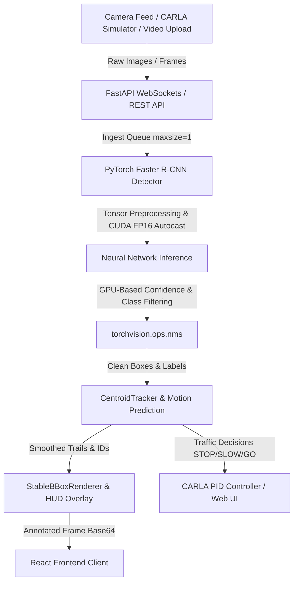

# 🚗 Autopilot AI — Real-Time Autonomous Vehicle Detection & Decision-Making

A high-performance, real-time autonomous driving perception system that combines **PyTorch Faster R-CNN**, **CARLA Simulator integration**, and a **React + FastAPI** full-stack pipeline to detect objects, track motion, and make live driving decisions (STOP / SLOW / GO).

---

## 📐 System Architecture

The system runs on a producer-consumer model: frames are ingested from multiple sources, passed through real-time tensor transformations, filtered using hardware-accelerated computer vision algorithms, and rendered back to the UI — all with near-zero lag via frame-dropping queues.

---

## ✨ Key Features

- 🎯 Real-time object detection using **Faster R-CNN ResNet-50 FPN v2**
- 🧠 GPU-accelerated inference with **FP16 mixed precision (CUDA)**
- 🎥 Live camera streaming via **WebSocket** (25 FPS / 40ms interval)
- 🛰️ **CARLA Simulator** integration (v0.9.16) with PID-based vehicle control
- 📍 Centroid-based object tracking with constant-velocity motion prediction
- 🚦 Automated decision engine: **STOP / SLOW / GO**
- 📊 Live telemetry dashboard (CPU%, GPU%, VRAM, FPS, Latency)
- 🖼️ Stabilized bounding boxes with HUD overlays

---

## 🛠️ Tech Stack

| Layer | Technologies |
|---|---|
| **Frontend** | React, TypeScript, TailwindCSS, Vite, Shadcn/ui, Lucide Icons |
| **Backend** | Python, FastAPI, Uvicorn, Pydantic |
| **Machine Learning** | PyTorch, Torchvision (`fasterrcnn_resnet50_fpn_v2`), CUDA, FP16 |
| **Computer Vision** | OpenCV, Centroid Tracking, IoU, GPU-based NMS |
| **Simulation** | CARLA Simulator v0.9.16 (Python API) |
| **Database** | In-memory thread-safe dictionary, local filesystem |
| **APIs** | REST, WebSockets |
| **Deployment** | Docker, Docker Compose, Windows Batch/PowerShell scripts |

---

## 📁 Project Structure
