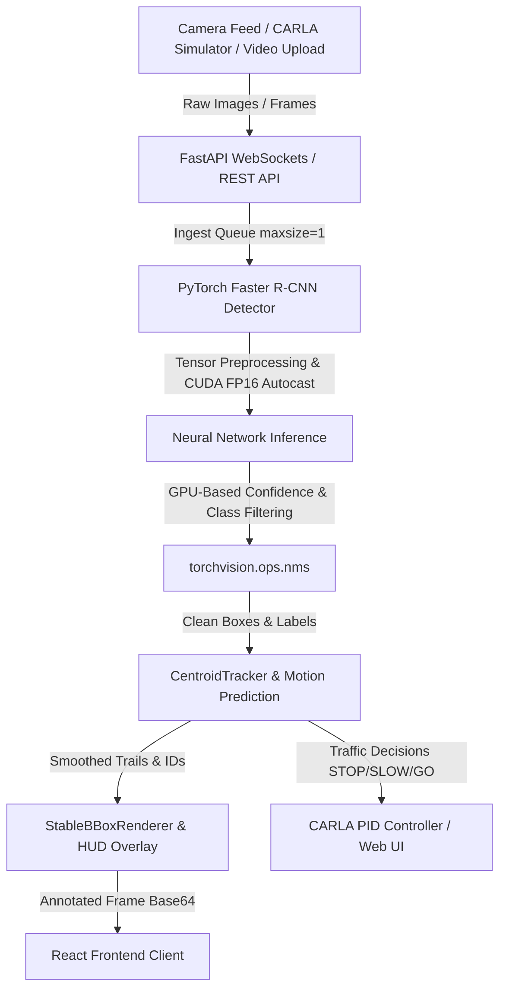

# 🚗 Autopilot AI — Real-Time Autonomous Vehicle Detection & Decision-Making

A high-performance, real-time autonomous driving perception system that combines **PyTorch Faster R-CNN**, **CARLA Simulator integration**, and a **React + FastAPI** full-stack pipeline to detect objects, track motion, and make live driving decisions (STOP / SLOW / GO).

---

## 📐 System Architecture



The system runs on a producer-consumer model: frames are ingested from multiple sources, passed through real-time tensor transformations, filtered using hardware-accelerated computer vision algorithms, and rendered back to the UI — all with near-zero lag via frame-dropping queues.

---

## ✨ Key Features

- 🎯 Real-time object detection using **Faster R-CNN ResNet-50 FPN v2**
- 🧠 GPU-accelerated inference with **FP16 mixed precision (CUDA)**
- 🎥 Live camera streaming via **WebSocket** (25 FPS / 40ms interval)
- 🛰️ **CARLA Simulator** integration (v0.9.16) with PID-based vehicle control
- 📍 Centroid-based object tracking with constant-velocity motion prediction
- 🚦 Automated decision engine: **STOP / SLOW / GO**
- 📊 Live telemetry dashboard (CPU%, GPU%, VRAM, FPS, Latency)
- 🖼️ Stabilized bounding boxes with HUD overlays

---

## 🛠️ Tech Stack

| Layer | Technologies |
|---|---|
| **Frontend** | React, TypeScript, TailwindCSS, Vite, Shadcn/ui, Lucide Icons |
| **Backend** | Python, FastAPI, Uvicorn, Pydantic |
| **Machine Learning** | PyTorch, Torchvision (`fasterrcnn_resnet50_fpn_v2`), CUDA, FP16 |
| **Computer Vision** | OpenCV, Centroid Tracking, IoU, GPU-based NMS |
| **Simulation** | CARLA Simulator v0.9.16 (Python API) |
| **Database** | In-memory thread-safe dictionary, local filesystem |
| **APIs** | REST, WebSockets |
| **Deployment** | Docker, Docker Compose, Windows Batch/PowerShell scripts |

---

## 📁 Project Structure

```
autopilot-ai/
├── package.json                      # Frontend metadata, dependencies, scripts
├── tsconfig.json                     # TypeScript compiler settings
├── vite.config.ts                    # Vite asset bundling rules
├── src/                               # React frontend source code
│   ├── main.tsx                      # Mounting script for the DOM
│   ├── index.css                     # Global Tailwind CSS definitions
│   ├── components/                   # Reusable UI widgets
│   └── pages/                        # Routed views (AiDetectionPage.tsx, etc.)
└── backend/                           # Python backend source code
    ├── main.py                       # Main FastAPI gateway and routers
    ├── config.py                     # Global settings, directories, and variables
    ├── fasterrcnn_detector.py        # Core PyTorch model inference class
    ├── tracker.py                    # Centroid tracker & line crossings logic
    ├── advanced_detector.py          # Combines detection, tracking, and decisions
    ├── stable_renderer.py            # Handles visual styles, overlays, and HUDs
    ├── frame_optimizer.py            # Provides temporal smoothing filters
    ├── video_processor.py            # Handles threaded video parsing
    ├── pygame_autopilot.py           # Interactive CARLA loop with local UI window
    ├── pygame_autopilot_no_camera.py # Headless CARLA loop
    └── test_fasterrcnn.py            # PyTest suite for ML components
```


---

## ⚙️ How It Works — Request Flow

What happens when a user clicks **"Run Live Camera"**:

1. Click **Live** in React UI → triggers MediaDevices API and opens a WebSocket to port 8000.
2. Frame captured on Canvas every 40ms → converted to JPEG → sent as Base64 over WebSocket.
3. FastAPI receives the frame → decodes to NumPy array → pushes to a single-slot `frame_queue` (drops stale frames).
4. Model worker thread picks up the frame → preprocesses → FP16 autocast inference → GPU-based NMS.
5. Tracker receives detections → updates trajectories → calculates crossing events and distance bounds.
6. Planning engine decides action (**GO / SLOW / STOP**) → `StableBBoxRenderer` draws HUD overlays.
7. FastAPI encodes the annotated image to Base64 JPEG → sends it back over WebSocket.
8. React updates `liveFrame` and `stats` state → renders live canvas and telemetry panel.

---

## 🧠 Machine Learning Pipeline

### Model
- **Faster R-CNN ResNet-50 FPN v2** (two-stage detector)
  - Feature Pyramid Network (multi-scale feature extraction)
  - Region Proposal Network (candidate bounding boxes)
  - RoIAlign (accurate feature extraction)
  - Fast R-CNN Head (classification + bbox regression)

### Optimization
- Input resized to `min_size=360`, `max_size=640`
- `torch.backends.cudnn.benchmark = True` for fastest CUDA convolution algorithm
- `torch.amp.autocast("cuda", dtype=torch.float16)` mixed precision
- Confidence threshold: `0.70` | NMS IoU threshold: `0.40`

### Tracking
- Constant-velocity predictor extrapolates positions on skipped frames
- Euclidean centroid matching links detections across frames

---

## 🔌 API Endpoints

| Method | Endpoint | Description |
|---|---|---|
| `POST` | `/ai/process-video` | Starts a background video job, returns `job_id` |
| `GET` | `/ai/status/{job_id}` | Returns progress logs, decisions, frame count |
| `GET` | `/ai/frame/{job_id}` | Streams processed frames |
| `WS` | `/ws/ai-camera` | Real-time duplex WebSocket for live camera streaming |
| `WS` | `/ws/yolo` | Backward-compatible camera router |

---

## 🎮 CARLA Simulator Integration

- **RGB Camera** attached to the ego vehicle, streaming frames to a memory buffer
- **LIDAR / Collision Sensors** feed autopilot risk-evaluation scripts
- **`pygame_autopilot*.py`** scripts:
  - Initialize the ego vehicle in CARLA
  - Bind camera frames to the Faster R-CNN pipeline
  - Determine risk state (STOP / SLOW / GO)
  - Send throttle/steering/brake commands via PID controller

Backend connects to the CARLA server over **TCP port 2000**.

---

## 🚀 Installation & Setup

### Prerequisites
- Python 3.12
- Node.js 20+
- CUDA-enabled GPU (recommended for real-time inference)
- CARLA Simulator v0.9.16 (optional, for simulation mode)

### Backend Setup
```bash
cd backend
pip install -r requirements-backend.txt
uvicorn main:app --reload --port 8000
```

### Frontend Setup
```bash
npm install
npm run dev
```

### Environment Variables
CARLA_HOST=localhost
CARLA_PORT=2000
ENABLE_CARLA=true
---

## 📊 Live Telemetry Dashboard

The dashboard displays real-time metrics:
- CPU % / GPU % / VRAM Allocation (MB)
- Throughput FPS / Model FPS
- Latency (ms)
- Active tracked objects

---

## 📄 Additional Documentation

- [Camera Fix Guide](./CAMERA_FIX.md)
- [IRIUN Webcam Setup](./IRIUN_WEBCAM_SETUP.md)
- [Live Camera Guide](./LIVE_CAMERA_GUIDE.md)
- [Quick Start Guide](./QUICK_START_FIXED.md)
- [Upload Display Fix](./UPLOAD_DISPLAY_FIX.md)

---

-##  RUDRA PARMAR

